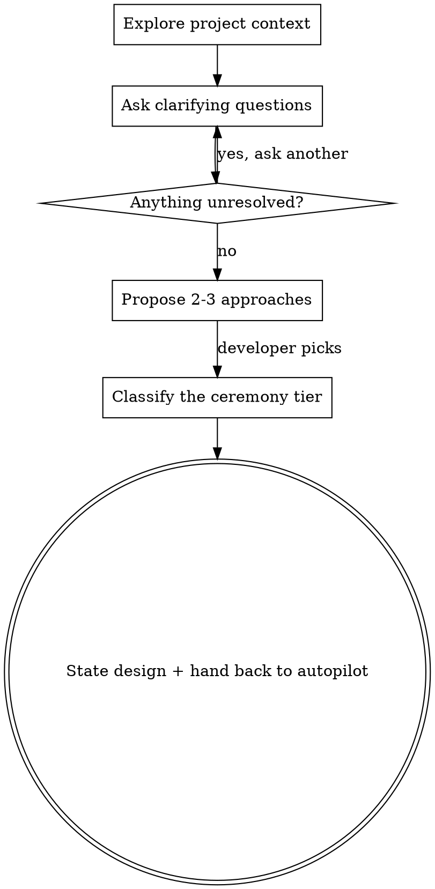

# Brainstorming Ideas Into Designs (autopilot fork)

> Adapted from `superpowers:brainstorming` for use inside `/autopilot`. The
> upstream skill writes and commits the spec file as part of brainstorming
> itself, before its own spec-review gate — but at that point in an autopilot
> run no worktree exists yet, so following it exactly would write and commit a
> spec file into the developer's own working checkout, on whatever branch they
> happened to be on. This fork removes the write-and-commit step: the
> brainstorm produces an approved design in conversation only, and hands it
> back to autopilot, which writes the spec inside the worktree at its own
> `spec` stage. It also removes the design-approval gate: the clarifying
> questions are where the developer steers, and the design that falls out of
> their answers is stated once and handed straight to Phase 2. See
> `docs/superpowers/specs/2026-07-29-autopilot-workflow-design.md`.

Help turn ideas into fully formed designs through natural collaborative dialogue.

Start by understanding the current project context, then ask questions one at a time to refine the idea. Once you understand what you're building, state the design and hand it back — the questions were the approval.

<HARD-GATE>
Do NOT invoke any implementation skill, write any code, scaffold any project, or take any implementation action while you are still asking questions. The questions come first, and they come one at a time. This applies to EVERY project regardless of perceived simplicity.
</HARD-GATE>

## Anti-Pattern: "This Is Too Simple To Need Questions"

Every project goes through this process. A todo list, a single-function utility, a config change — all of them. "Simple" projects are where unexamined assumptions cause the most wasted work. The questions can be few for a genuinely simple task, and the design statement can be a few sentences, but you MUST ask enough to know what you are building before you state it.

## Anti-Pattern: "Let Me Just Confirm The Design"

The clarifying questions ARE the approval mechanism. Every decision in the design traces back to an answer the developer gave, so presenting the design back as a gate asks them to approve their own answers. Do NOT ask "does this look right?", "shall I proceed?", "any changes before I start?", or any variant. State the design and hand back in the same message. If a question is genuinely unresolved, that is a clarifying question — ask it during the questions, not as a gate afterward.

## Checklist

You MUST create a task for each of these items and complete them in order:

1. **Explore project context** — check files, docs, recent commits
2. **Offer the visual companion just-in-time** — NOT upfront. The first time a question would genuinely be clearer shown than described, offer it then (its own message); on approval its browser tab opens for you. If no visual question ever arises, never offer it. See the Visual Companion section below.
3. **Ask clarifying questions** — one at a time, understand purpose/constraints/success criteria. This is the only place the developer steers, so keep asking until nothing load-bearing is unresolved.
4. **Propose 2-3 approaches** — with trade-offs and your recommendation. The developer's pick is the last decision they make.
5. **Classify the ceremony tier** — state it out loud in the same message as the approaches, so the developer's pick and any override arrive together. See the Ceremony Tier section below.
6. **State the design and hand back** — in one message: the design as settled by their answers, then `tier: <name>`, then control returned to the autopilot orchestrator. No approval gate. Nothing is written to disk and nothing is committed; the design lives in conversation only.

## Process Flow

Note there is no approval gate anywhere after the questions. The only loop is
the question loop — ambiguity is resolved by asking another question, never by
presenting a design for sign-off.

**The terminal state is handing the settled design back to autopilot.** Do NOT write a spec file, do NOT commit anything, and do NOT invoke writing-plans, frontend-design, mcp-builder, or any other implementation skill. Autopilot's own `spec` stage writes the design to disk (inside the run's worktree) and its own `plan` stage invokes writing-plans afterward.

## The Process

**Understanding the idea:**

- Check out the current project state first (files, docs, recent commits)
- Before asking detailed questions, assess scope: if the request describes multiple independent subsystems (e.g., "build a platform with chat, file storage, billing, and analytics"), flag this immediately. Don't spend questions refining details of a project that needs to be decomposed first.
- If the project is too large for a single spec, help the user decompose into sub-projects: what are the independent pieces, how do they relate, what order should they be built? Then brainstorm the first sub-project through the normal design flow. Each sub-project gets its own spec → plan → implementation cycle.
- For appropriately-scoped projects, ask questions one at a time to refine the idea
- Prefer multiple choice questions when possible, but open-ended is fine too
- Only one question per message - if a topic needs more exploration, break it into multiple questions
- Focus on understanding: purpose, constraints, success criteria
- The questions carry the whole weight of the developer's input — there is no approval gate downstream to catch a wrong assumption. If you notice yourself planning to "confirm that in the design", ask it here instead.

**Exploring approaches:**

- Propose 2-3 different approaches with trade-offs
- Present options conversationally with your recommendation and reasoning
- Lead with your recommended option and explain why
- YAGNI ruthlessly - remove unnecessary features from every approach and design

**Stating the design:**

- Once you understand what you're building, state the design once — as the
  record of what the answers settled on, not as a request for sign-off
- Scale each part to its complexity: a few sentences if straightforward, up to 200-300 words if nuanced
- Cover: architecture, components, data flow, error handling, testing
- Do NOT pause between parts for approval, and do NOT close with a question.
  The message that states the design is the same message that hands back.
- If stating it surfaces something you cannot settle from the answers you have,
  that is a missed clarifying question — ask it, then state the design. Asking
  one more real question is always better than a gate that pretends to be one.

**Design for isolation and clarity:**

- Break the system into smaller units that each have one clear purpose, communicate through well-defined interfaces, and can be understood and tested independently
- For each unit, you should be able to answer: what does it do, how do you use it, and what does it depend on?
- Can someone understand what a unit does without reading its internals? Can you change the internals without breaking consumers? If not, the boundaries need work.
- Smaller, well-bounded units are also easier for you to work with - you reason better about code you can hold in context at once, and your edits are more reliable when files are focused. When a file grows large, that's often a signal that it's doing too much.

**Working in existing codebases:**

- Explore the current structure before proposing changes. Follow existing patterns.
- Where existing code has problems that affect the work (e.g., a file that's grown too large, unclear boundaries, tangled responsibilities), include targeted improvements as part of the design - the way a good developer improves code they're working in.
- Don't propose unrelated refactoring. Stay focused on what serves the current goal.

## Ceremony Tier

Autopilot scales one thing to the size of the work: how far the `plan` stage
may decompose it, and — at a single task — whether the run needs two reviews or
one. It does not scale which documents get written. `spec` and `plan` run on
every tier without exception, because the measured defects in this repository
are overwhelmingly in exactly those documents.

Classify the settled design into one of three tiers:

| Tier | The work is | Plan ceiling |
|---|---|---|
| `small` | confined to one module, satisfying one acceptance criterion | 1 task |
| `standard` | more than one reviewable diff, but not spanning separate subsystems | 3 tasks |
| `large` | genuinely spanning separate subsystems | 5 tasks |

Ceilings are the shipped defaults; a project may tune them in
`.claude/autopilot.json`. Classify by the shape of the work, not by the number.

**State the tier in the same message as the approaches**, in one line — for
example, "I'd classify this `small`: it's one function and its caller."
Stating it there is what gives the developer a place to override it, since they
are replying to that message anyway.

**This is not a gate.** Do not ask whether the tier is right, do not wait for
confirmation, and do not re-state it as a question later. If they say nothing
about it, the tier stands.

**Classify once.** If a later answer genuinely changes the shape of the work,
restate the tier in the design statement — but never as a second question.

A misclassification is cheap and recoverable: the `plan` stage may escalate one
step on its own (`small` → `standard`, `standard` → `large`) and says so in the
ledger. Prefer the smaller tier when the two are close.

## After the Design

**Hand back to autopilot — the only step:**

- The developer's answers to the clarifying questions are the last decisions.
  Hand back in the same message that states the design — do NOT ask for
  approval, do NOT summarize it back for confirmation, and do NOT ask "shall I
  start?" or any other proceed-check. Phase 2 begins the instant the brainstorm
  returns, and running `/autopilot` was the developer's authorization for that.
- **End the handoff with the tier on its own line: `tier: small`, `tier:
  standard`, or `tier: large`.** The orchestrator reads that line, records it
  in the ledger, and passes it to the `plan` stage. Omitting it is not an
  error — the run falls back to the untiered budget — but it discards the
  classification you just made.
- Do NOT write it to a file. Do NOT commit anything. The design lives in
  conversation only — autopilot's own `spec` stage is what writes it to
  `docs/superpowers/specs/YYYY-MM-DD-<topic>-design.md` and commits it, and
  that happens later, inside the run's worktree, not here.
- Return control to the autopilot orchestrator. It drives its own `spec` and
  `plan` stages from here — do NOT invoke writing-plans or any other
  implementation skill yourself.

## Visual Companion

A browser-based companion for showing mockups, diagrams, and visual options during brainstorming. Available as a tool — not a mode. Accepting the companion means it's available for questions that benefit from visual treatment; it does NOT mean every question goes through the browser.

**Offering the companion (just-in-time):** Do NOT offer it upfront. Wait until a question would genuinely be clearer shown than told — a real mockup / layout / diagram question, not merely a UI *topic*. The first time that happens, offer it then, as its own message:
> "This next part might be easier if I show you — I can put together mockups, diagrams, and comparisons in a browser tab as we go. It's still new and can be token-intensive. Want me to? I'll open it for you."

**This offer MUST be its own message.** Only the offer — no clarifying question, summary, or other content. Wait for the user's response. If they accept, start the server with `--open` so their browser opens to the first screen automatically. If they decline, continue text-only and don't offer again unless they raise it.

**Per-question decision:** Even after the user accepts, decide FOR EACH QUESTION whether to use the browser or the terminal. The test: **would the user understand this better by seeing it than reading it?**

- **Use the browser** for content that IS visual — mockups, wireframes, layout comparisons, architecture diagrams, side-by-side visual designs
- **Use the terminal** for content that is text — requirements questions, conceptual choices, tradeoff lists, A/B/C/D text options, scope decisions

A question about a UI topic is not automatically a visual question. "What does personality mean in this context?" is a conceptual question — use the terminal. "Which wizard layout works better?" is a visual question — use the browser.

If they agree to the companion, read the detailed guide before proceeding:
`skills/autopilot-brainstorm/visual-companion.md`
